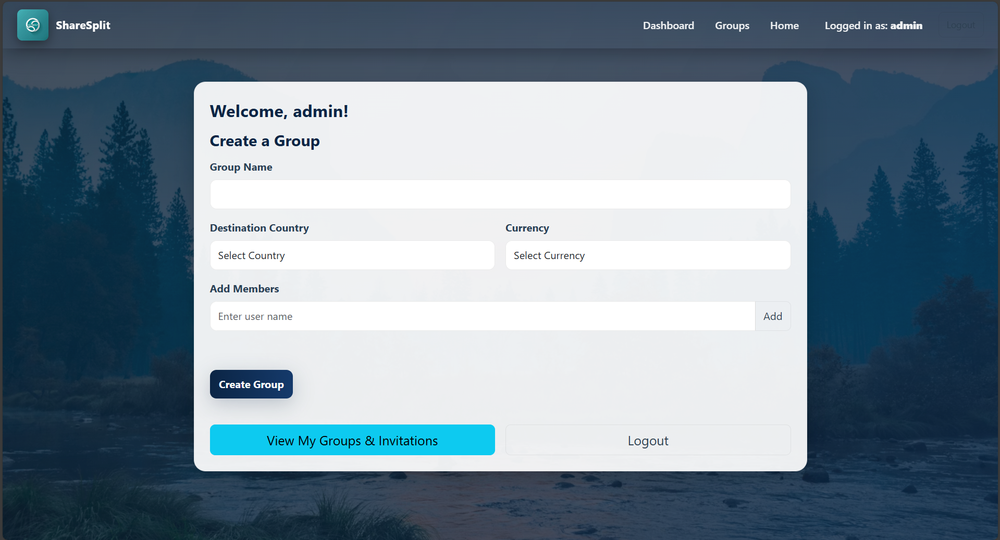
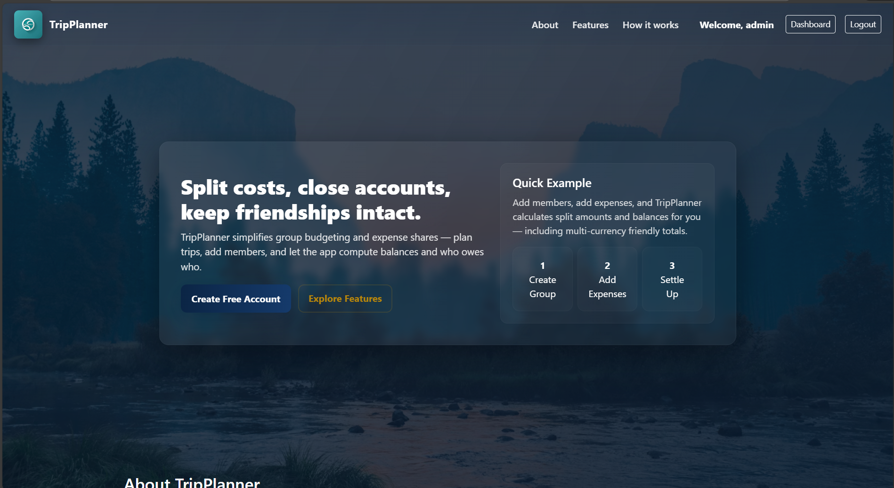

<h1 align="center">ShareSplit 💸</h1>
<p align="center">
  A simple and smart expense-splitting web app with real-time currency conversion — built using PHP, HTML, CSS, JavaScript, and MySQL.
</p>

---

## 🚀 Overview

ShareSplit helps users split expenses, manage group trips, and convert currencies in real time.  
It eliminates confusion about “who owes what” and keeps all shared costs organized in one place.

Key features include:

- Group-based expense tracking  
- Real-time currency conversion  
- Balance calculation between members  
- Clean dashboard UI  
- User authentication (signup/login)  
- AJAX-powered updates  
- Database-driven trip and expense management  
- (Upcoming) Payment gateway integration for settlements  

---

## 🛠️ Tech Stack

### **Frontend**


### **Backend**


### **Database**


### **Utilities**


---

## 📌 Features

- Create Groups & Add Members
- Add & Track Expenses For Each Individual 
- Real-Time Currency Conversion According To The User Location 
- Equal Split & Balance Calculation  
- Secure Login & Signup System  
- AJAX Updates  
- Export Expenses as PDF  
- Mobile and PC Friendly User Interface 

### 🧩 **Upcoming Features**
- Payment gateway for instant settlement  
- Multi-category expense support  
 

---

## 📂 Project Structure

> Note: This project currently uses mixed PHP, HTML, CSS, and JS inside PHP files.  
> This structure represents the **logical organization**, not the physical folders.
```
Trip-Planner/
│── index.php               # Home page
│── login.php               # User login
│── signup.php              # User signup
│── dashboard.php           # Main dashboard
│── group.php               # Create/manage groups
│── group_dashboard1.php    # Group dashboard
│── group_info.php          # Group details page
│── group_info_ajax.php     # AJAX handlers for updates
│── search_user.php         # Search users
│── logout.php              # Logout functionality
│── db_connect.php          # Database connection (MySQL)
│── tripplanner.sql         # Database schema
|── privacy.php             # Privacy Policy
│
├── assets/                 # (Planned folder for future)
│   ├── css/                # Stylesheets (currently inline)
│   ├── js/                 # Scripts (currently inline)
│   └── images/             # UI images
│
└── includes/               # (Future modular components)
    ├── header.php
    └── footer.php
```

## 🔧 Installation

1. Clone the repository  
   ```
   git clone https://github.com/sohnx/Trip-Planner.git
   ```
2. Move the project into your XAMPP htdocs folder(xampp\htdocs\Trip-Planner)
3. Start Apache & MySQL from XAMPP Control Panel.
     - Import the database
     - Open phpMyAdmin
     - Create a database (e.g., trip_planner)
     - Import tripplanner.sql
     - Update database credentials in db_connect.php if needed.

4. Visit the app in your browser
```
   http://localhost/Trip-Planner/
```

---

## ✅ **2. Usage (How to Use the App)**
Short, clear, functional.

```md
## ▶️ Usage

1. Create an account or log in.  
2. Create a new trip or group.  
3. Add participants.  
4. Add shared expenses with optional currency selection.  
5. View automatic balance calculations.  
6. Track settlements and manage your group dashboard.  
```

---

## 🐞 Known Issues

- Inline CSS and JS make some files harder to maintain  
- No form validation on some pages  
- Error handling needs improvement

---

## 📸Screenshots
<p align="left">  </p>
<p align="right">  </p>

---
